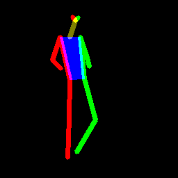
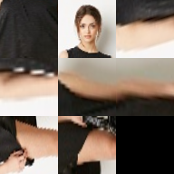

# Pytorch reimplementation of "A Variational U-Net for Conditional Appearance and Shape Generation"

* original (tensorflow) code is in folder `original`
* pytorch code is in `src`


# Getting the datasets

* refer to the original authors code release to get the datasets.


# Running the model


* The experiment uses the [edflow](https://github.com/pesser/edflow) framework for running experiments.
* The code depends on this [library](https://github.com/theRealSuperMario/supermariopy)
* create a config file as in `configs`
* run with 
```bash
edflow -b configs/xxx.yaml -t -n xxx

# interupt with CTRL + c, then continue with
edflow -b configs/xxx.yaml -t -p xxx
```


# Pretrained Checkpoints

* the authors released original checkpoints [on their page](https://github.com/CompVis/vunet).
* Checkpoints in Pytorch are coming soon.


# TODO:
[x] implement KL scheduling
[ ] add other datasets, such as Fashion MNIST


# Notes

## Inplane Normalization

* When using the inplane normalization, it becomes quite unecessary to regularize the KL. Furthermore, without the Inplane Normalization, the method is quite hard to get to work on humans this. They state this in the paper:

> In some difficult cases, [...] it is difficult to perform
appearance transfer from one object to another with no part
correspondences between them. This problem is especially
problematic when generating human beings. To cope with
it we propose to use additional in-plane normalization utilizing the information provided by the shape estimate yˆ. 
In our case yˆ is given by the positions of body joints which
we use to crop out areas around body limbs. This results
in 8 image crops that we stack together and give as input
to the generator Fφ instead of x. If some limbs are missing
(e.g. due to occlusions) we use a black image instead of the
corresponding crop.

* see [notebooks/inplane_normalization.ipynb](notebooks/inplane_normalization.ipynb)


|   | Sample from joint: X  | Shape conditioning: C  |
|---|---|---|
|   |   | 
| Localize using C |   | 
| Crop and normalize |   | 


### Apply this on all of the input images

| X  |   |  |  |
|----|---|---| ---|
| X; C | |  |  |


